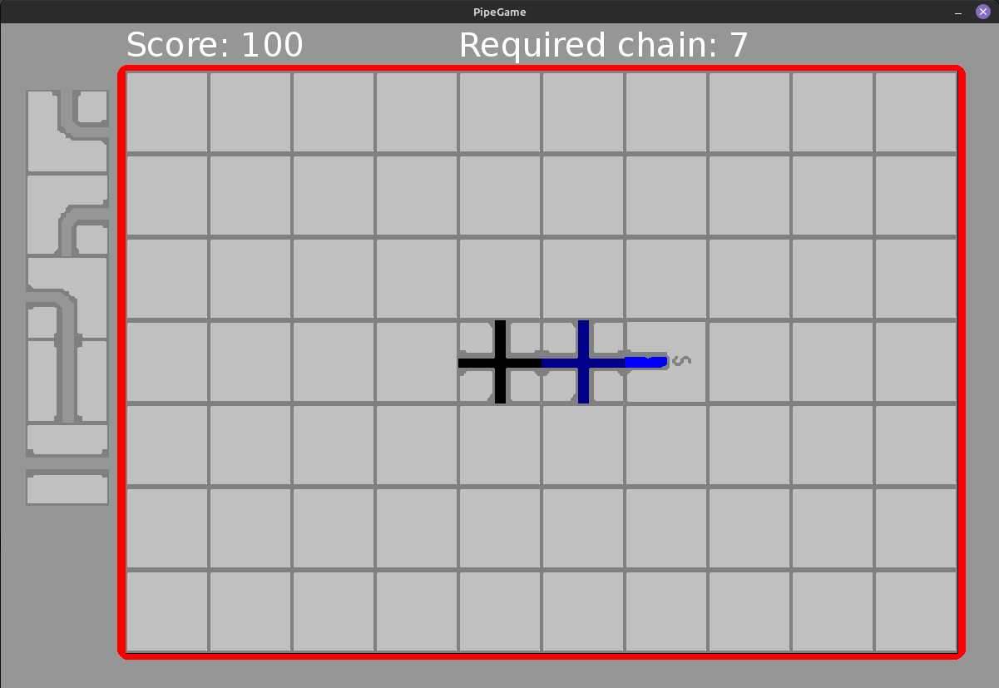
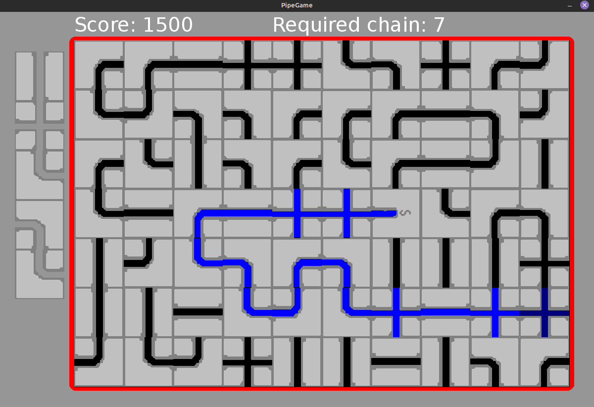

# Pipe Hell

This is a remake of a 1989 game [Pipe Mania](https://en.wikipedia.org/wiki/Pipe_Mania)

## Gameplay

The main objective of this game is to get as big of a score as possible.

When the game starts a buffer of cells is generated on the left. You can use the mouse to place cells from the buffer (Always the last node in the buffer).

Slowly pipes are going to fill up with water and the goal is to chain as many pipes as possible.

The game ends if there is no more pipes for the water to go in. At this point if the amount of chained pipes is over the required amount the game will advance to the next stage where water flows faster, and you need to chain more pipes, but you get more score.

If you did not reach the required amount of pipes for the stage. The game will end, and you will be forced to restart.

## Building and running

You can build this game through intellij with running PipeGame.scala

## Screenshots

